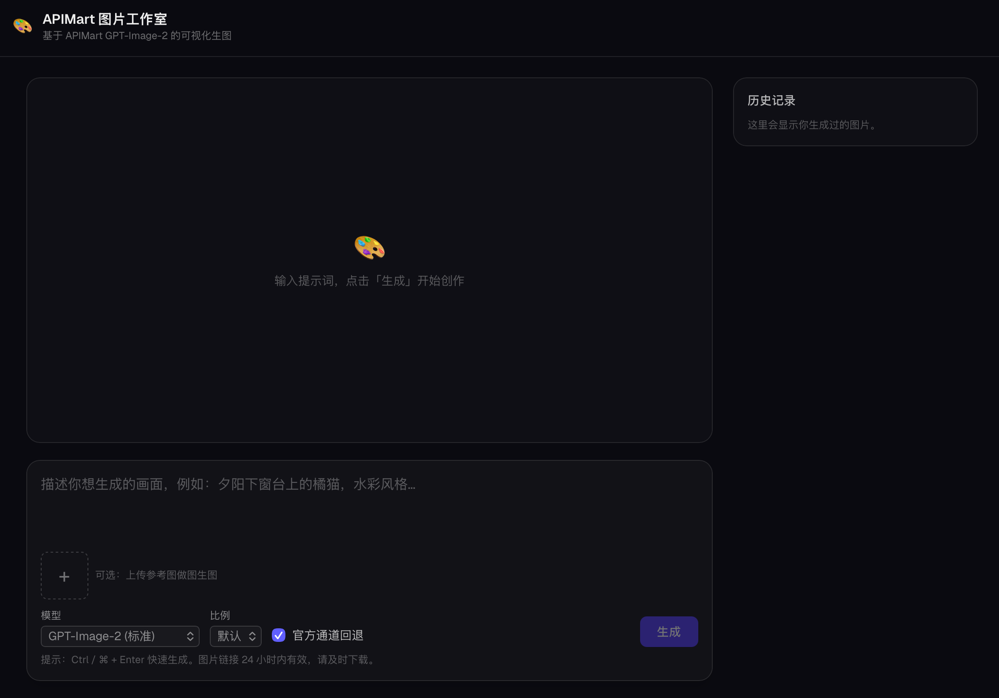

# 🎨 图片工作室

一个像 ChatGPT 网页端那样的可视化生图页面：输入提示词 → 选择参数 → 点击生成 → 查看 / 下载图片。

当前支持两条生成链路：

- [APIMart](https://docs.apimart.ai) 的 `gpt-image-2` 异步图片生成 API
- local_imagen，自定义 `URL + Key`（提供image2模型的中转站使用） 的 OpenAI 兼容服务，经过 TypeScript 包装器转调官方 `image_gen.py`

## 界面预览



## 特性

- **文生图 / 图生图**：支持上传参考图（最多 16 张，自动转 base64）。
- **多通道切换**：可在 APIMart 与自定义 URL/Key 之间切换。
- **模型与参数**：
  - APIMart：`gpt-image-2`（标准）/ `gpt-image-2-official`（官方通道）；可选比例（13 种）、分辨率（官方通道 1k/2k/4k）、官方通道回退。
  - 自定义 URL/Key：调用官方 `image_gen.py`，支持比例与 `quality`（`low / medium / high / auto`）。
- **异步轮询**：提交后自动轮询任务状态，完成后展示图片。
- **服务端自动落盘**：任务完成后，后端会把图片下载保存到本地目录（默认 `generated/`），不依赖 24h 链接、清缓存也不丢；页面会显示保存目录与文件名。
- **本地历史**：生成记录保存在浏览器 `localStorage`，可回看 / 下载。
- **密钥安全**：API Key 只存在于服务端（Next.js Route Handler 代理），不会暴露给浏览器。

## 架构

```
浏览器(UI) ──prompt/provider──▶ /api/generate
                                   ├─ APIMart ──▶ POST /v1/images/generations ──▶ task_id ──▶ /api/task/[id] 轮询
                                   └─ local-imagegen ──▶ TS 包装器 ──▶ 官方 image_gen.py ──▶ 本地输出文件
```

- 服务端逻辑：
  - `src/lib/apimart.ts`：APIMart 提交、轮询、解析响应
  - `src/lib/localImagegen.ts`：读取 env、调用官方 `image_gen.py`
- API 路由：`src/app/api/generate/route.ts`、`src/app/api/task/[id]/route.ts`。
- 前端：`src/components/ImageStudio.tsx`。

## 本地运行

```bash
cp .env.example .env.local
npm install
npm run dev                  # http://localhost:3000
```

## 环境变量

| 变量 | 必填 | 说明 |
| --- | --- | --- |
| `APIMART_API_KEY` | 否 | 使用 APIMart 时必填 |
| `APIMART_BASE_URL` | 否 | 默认 `https://api.apimart.ai/v1` |
| `LOCAL_IMAGEGEN_BASE_URL` | 否 | 使用自定义 URL/Key 时必填，直接映射到子进程 `OPENAI_BASE_URL` |
| `LOCAL_IMAGEGEN_API_KEY` | 否 | 使用自定义 URL/Key 时必填，直接映射到子进程 `OPENAI_API_KEY` |
| `OFFICIAL_IMAGEGEN_PATH` | 否 | 默认 `~/.codex/skills/.system/imagegen/scripts/image_gen.py` |
| `IMAGE_STUDIO_OUTPUT_DIR` | 否 | 图片自动保存目录，默认 `generated`（相对路径基于项目根目录） |
| `APIMART_OUTPUT_DIR` | 否 | 旧变量名，仍兼容，优先级低于 `IMAGE_STUDIO_OUTPUT_DIR` |

## 部署到 Vercel

如果你只使用 APIMart，导入仓库后在 Project Settings → Environment Variables 中添加 `APIMART_API_KEY` 即可。

如果你还要启用自定义 URL/Key，额外配置：

- `LOCAL_IMAGEGEN_BASE_URL`
- `LOCAL_IMAGEGEN_API_KEY`
- 如有需要，再配置 `OFFICIAL_IMAGEGEN_PATH`

## 说明

- APIMart 生成的图片链接 **24 小时内有效**；本应用会在任务完成时自动把图片保存到服务端 `IMAGE_STUDIO_OUTPUT_DIR`（默认 `generated/`），即使链接过期本地副本仍在。该目录已加入 `.gitignore`，不会被提交。
- 注意：服务端落盘发生在运行 Next.js 的机器上。本地 `npm run dev` 时即你自己的电脑；部署到 Vercel 等无持久文件系统的平台时，落盘文件不会持久保留，此功能主要适用于本地 / 自托管运行。
- `gpt-image-2` 比例不要传 `auto`；想用默认比例就不选（留空）。
- 分辨率 `4k` 仅支持 `16:9 / 9:16 / 2:1 / 1:2 / 21:9 / 9:21`，且只在官方通道模型下可用。
- 自定义 URL/Key 模式会把比例映射成固定尺寸，再传给官方 `image_gen.py`。首版禁用 `21:9` 和 `9:21`。
- 自定义 URL/Key 模式当前只暴露最小参数集：`prompt / 参考图 / 比例 / quality`。
